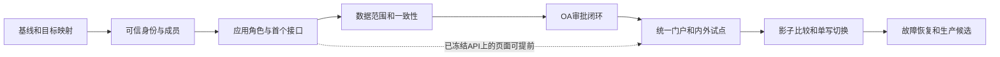

# 整体改造执行计划

## 1. 范围与结果

输入：用户提供的 `oa-auth-phased-plan` v0.2 全部 12 个文件；摘要见 [SOURCE_MANIFEST](SOURCE_MANIFEST.json)。源方案中的表名、接口名、样例和预算是设计输入，不能当成现有能力。

改造三个现有仓库，保留 Java 21、各仓 Spring Boot 版本、关系型数据库及现有部署边界。auth 和 OA 形成一个用户可见的平台，权限决策由 auth 提供，业务服务执行资源归属与查询过滤。消费者会员体系不在首版 CIAM 改造范围。

| 仓库 | 最终职责 | 改造重点 |
|---|---|---|
| auth-platform | Casdoor 接入、主体与成员消费模型、应用准入、角色版本、授权与数据范围、决策、图投影及审计 | 从现有关系判权扩展为有业务记录权威的授权平台 |
| oa-platform | 现有办公业务、员工／部门来源适配、权限审批、待办与通知；自身也成为接入应用 | 复用 `oa-iam` 规则与测试资产，逐项迁移治理所有权；保留旧路径至验收 |
| commerce-platform | 业务身份映射、接口及页面权限、MySQL 数据范围执行、业务状态和资源事实 | 先接一个内部只读接口，再扩展受控写路径、外部协作、存量迁移 |

最终每个应用维护自己的权限清单和业务资源事实；平台维护角色、成员授权、管理上限和审计。企业管理员不用在每个项目重复建人和独立分配同一类平台权限。

## 2. 用户、角色与项目接入方式

### 内部用户

1. 登录身份以可信 `(issuer, sub)` 映射全局 Principal；邮箱相同不自动合并。保留 OA 旧 sub、商城 actorId/memberId 的映射。
2. 人加入企业形成 Membership，员工关系单独保存；跨企业切换必须验证当前有效成员关系。离职、成员停用、应用退出分别处理。
3. 应用负责人登记 Application、Environment、TenantApplication，发布版本化能力清单及菜单／按钮映射；应用登录客户端与业务应用准入分别验证。
4. 角色属于企业、应用和环境。相同“运营”名称在 OA 与商城各有独立角色版本；授权引用固定版本，扩权产生新版本和重新授予流程。
5. 个人、受信组或岗位规则产生有来源的独立 Grant。移岗只撤相应来源，不误删仍然合法的其他个人授权；组授权待 P3 栅栏完成后启用。
6. 菜单和按钮根据展示读模型显示；后端每次检查动作、资源及当前状态。列表和导出按当前动作对应的范围，在分页和统计前过滤。

### 外部人员

1. 首版采用企业租户内受邀成员；合作方负责人 sponsor、用途、合作方引用、有效期必须有记录。独立合作企业租户只读自己的数据。
2. 邀请以高熵单次凭据哈希保存，接受时绑定已认证身份；并发接受通过条件更新保证唯一。接受邀请不等于获得应用和业务权限。
3. 外部成员使用单独应用准入、角色和有限数据范围，默认不能查看员工目录、内部 OA 菜单和平台管理接口。
4. 业务资源归属由业务后端验证。源方案中的供应商订单场景需要真实 supplier 关系和查询接口；商城当前 STORE/MERCHANT 范围不能自动冒充供应商订单范围。
5. 合作结束、到期、停用和 sponsor 变更触发生命周期校验与回收。已完成撤权后发起的新检查不得使用旧授权；已有其他合法授权仍可独立成立。

### 管理权限

平台运维、企业管理员、应用负责人、授权管理员、审批人和审计人按职责分开。管理员只能在可授予上限内操作，不能凭自己的业务访问权转授；不能自批、通过改自己的角色扩权，或因 Casdoor `isAdmin` 自动获得所有业务应用。首次管理员由受控引导建立。

## 3. 阶段与里程碑

| 阶段 | 核心交付 | 前置 | 退出条件 | 当前状态 |
|---|---|---|---|---|
| P0 基线 | 三仓证据、唯一所有权、ADR、真实试点入口、P1 范围 | 用户方案 | 差异和未验证项可追溯；足以启动受限 P1 设计 | COMPLETE_WITH_LIMITATIONS |
| P1 身份与目录 | Principal／LoginIdentity／Tenant／Membership、可信上下文、邀请与生命周期 | P0；具体契约冻结 | 真 Token 正反例、成员隔离、重复乱序、邀请并发、停用拒绝 | COMPLETE（隔离后端验收；共享升级 HOLD） |
| P2 应用 RBAC | 应用清单、角色版本、直接授权、单执行者投影、SDK、首个内部只读请求 | P1 核心身份契约 | 真实授予→检查允许→撤销拒绝；无旁路；旧 SDK 回归 | COMPLETE（历史P2交付） |
| P3 数据权限与一致性 | ScopePlan、查询／写入守卫、主库版本栅栏、远端 CAS、回执与组关系 | P2 最小闭环 | 同 Grant 绑定；双实例旧写拒绝；撤权完成后新请求无旧路径 | COMPLETE（两仓CI通过） |
| P4 OA 审批 | 请求快照、OA 实例与事件、Inbox、待生效状态、来源回收 | P3 安全底座 | 真实跨进程全链路、超时幂等、取消竞态、审批通过不冒充 ACTIVE | IN_PROGRESS |
| P5 门户与试点 | 统一工作台、管理台、内外部真实业务及浏览器验收 | P1—P4 所需契约 | 页面与后端一致；跨组织／应用／合作方反例；异常提示 | NOT_STARTED |
| P6 存量接管 | 映射导入、增量追平、影子比较、单一权威路由、预生产回退 | P5 试点通过 | 一批完整入口切换、旧写冻结、回退不复活撤权 | NOT_STARTED |
| P7 生产候选 | 容量、故障、密钥、恢复、观察、运行手册及发布评审 | P6 演练 | 实测证据、责任人和生产授权齐备；生产操作另行执行 | NOT_STARTED |

**M1=P2 最小内部闭环；M2=P5 完整内外部试点；M3=P6+P7 生产候选。** P2 不能宣称多实例撤权已证明；外部真实场景未定时不能宣称 M2 达成。阶段编号不代替切片依赖，详见 [DAG](EXECUTION_DAG.json)。

## 4. 每阶段如何落到项目

### P0：实施准备

复用已有三仓分析，核对源码和近期差异。完成真实 ref／脏文件记录、认证与检查链、SQL 与图写入口、版本和核心测试。准备阶段记录放在 `docs/implementation/oa-auth/phase-0/`，不修改产品源码、身份配置或共享授权图。

当前已完成 auth／OA 核心测试和 commerce 编译。commerce 定向测试的初次命令被上游空测试配置拦截，没有执行权限用例；真实登录、图投影及多实例验证仍须在相应阶段执行。具体结果见 [baseline](../../implementation/oa-auth/phase-0/baseline.md)。

### P1：先形成可验证的可信成员路径

- auth 新增一个治理库模块候选 `auth-platform-governance`，承载可供 admin 和 server 共用的成员、持久化和规则；控制器仍在现有进程，protocol 不依赖 Spring／OA。
- 第一条路径是“经验证登录身份→查当前有效企业成员→返回本人上下文”。只创建隔离夹具，不批量导入正式员工或覆盖旧主键。
- 独立 auth 治理业务数据库／Schema，复用 PostgreSQL 16；凭据库仍归 Casdoor，OA 表仍由 OA 写。P1 契约冻结时确定迁移工具、版本命名和 Mapper 装配。
- OA 通过公开目录边界发布事实；目录源未确认时只定义适配端口和隔离夹具，不接管正式目录。事件检查点含源、聚合和版本，冲突隔离，不完整快照不批量删人。
- 外部邀请、成员状态／generation、停用审计按独立纵向路径接入；重新加入递增 generation，旧组关系不能引用新代成员。

验收：错误 iss／aud、ID Token 当 API 凭据、失效 Token、伪造 tenant／principal、成员停用、邀请并发、乱序离职后旧消息全部覆盖。实际 S2S 调用服务与被代入用户的凭据分别验证。

回退：关闭新路径和隔离试点，保留兼容字段及旧身份映射；不回退已接受的停用事实。P1 不产生面向生产的授权图迁移。

### P2：完成 RBAC 第一条业务闭环

- `application-catalog` 与 `access-management` 落在治理模块；admin 提供受保护管理 API，auth-console 绑定真实 API 提供最小角色和授权状态页面。
- 应用清单由应用 Owner 发布，支持预览、版本和内容摘要；RoleVersion 不可变，AccessGrant 保留成员代际、来源、范围与固定 UTC 时间窗。
- 新中央治理图使用独立命名和唯一写入口；现有关系管理 API、直接脚本、Casdoor 组同步不能写这组受管事实。保留旧工作区能力，先限制边界再启用新图。
- SQL 授权记录、操作审计和 Outbox 在本地事务提交；单执行者图成功并持久化水位后才 ACTIVE。先不启用跨请求 ALLOW 缓存。
- protocol／sdk 新增类型化中央授权能力，保留 AuthzEngine 九项操作及旧行为。先验证 Boot 4.1.1 消费方自动装配、Jackson 共存、AOP 与直接调用，再接 commerce。
- 内部试点选择现有 `GET /v1/operations/stores`，候选能力 `commerce.store.read`，仅开放已登记的试点路径。细粒度角色不能映射为全局 ADMIN；现有业务 Actor、memberId 和幂等回执保留。

验收：无应用准入拒绝；相同角色名跨应用不串权；授予、待生效、允许、撤销闭环；缺项／错位批量响应及故障无 ALLOW；拒绝授权管理员自提权。页面隐藏后直接请求仍拒绝。

回退：取消新路径准入、保持未生效授权非 ACTIVE；旧 SDK 和旧工作区继续兼容。回退版本必须仍识别成员停用和已撤销 Grant。

### P3：数据权限与并发安全

- 同一 Grant 同时匹配动作、资源类型、scope、状态、时间和图 eligible，防止把“查询全部”和“操作单店”拼成“操作全部”。
- commerce 在 `StoreAccessService`／`StoreAccessMapper.xml` 先完成门店 ScopePlan 适配，再扩展商品、详情和指定写路径。租户条件与 scope 必须在分页、count、统计、搜索和导出前执行。
- OA 组织路径适配留在 OA；PG 的 `org_path` 策略不直接搬到商城 MySQL。未知范围／别名／映射默认拒绝，SDK 不发送任意 SQL、SpEL 或脚本。
- 建立 tenant/app/env PolicyPartition 和 tenant DirectoryFence。图投影新增远端版本标记 CAS；本地租约只负责领取，不足以防旧执行器远端覆盖。
- 每次检查使用当前权威主库快照、足够新图检查和新的主库快照复核；二次复核不能复用旧 repeatable-read 事务。ZedToken 为不透明水位，不能比较字符串取最大值。
- 收权返回“已接受”和“已完成”两个层次；到期在请求时判断。组、组织、Role／Scope、准入、成员变化都纳入栅栏。长导出在启动、批次和下载阶段复核。

验收：两个实例，旧执行器暂停后恢复、图写成功而 SQL 回执失败、远端超时未知结果、乱序、跨租户、到期和游标跨上下文等真实故障。撤权完成后的新检查不得使用已撤路径。

回退：分区保留 UPDATING/BLOCKED 并拒绝依赖它的请求；按最新意图对账，不能清空图或继续沿用旧 ALLOW。远端判权不能证明业务在途事务与撤权原子提交；需要更严格语义的写路径单独建提交前协议。

### P4：把现有 OA 审批接入授权生命周期

- auth 权威保存 AccessRequest 不可变快照、角色／scope／管理策略版本与固定时间窗；OA 保存实际流程实例、任务和审批证据。
- 复用 `oa-flow` 和现有工作流适配，不创建新 BPM。auth 的启动 Outbox 与 OA business key 幂等关联，超时先按 business key 查结果再重试。
- OA 审批结果通过受控生产者认证、Inbox 去重、payload hash 和状态 CAS 接入；事件中的操作者不能由 `approver_is_admin` 一类字段替代真实验证。
- 接受审批后再次校验管理上限、成员状态、角色版本和截止时间，再创建固定来源 Grant。审批通过但投影未完成显示“待生效”。
- 取消、拒绝、批准与回收有显式状态机；重复／旧事件不复活已取消授权。取消已批准请求只撤该请求来源，保留其他有效授权。
- 先复核 OA 普通 TEMPORARY 与 JIT 的语义：当前源码将 `TEMPORARY + APPROVAL` 视为 JIT，不能直接复用为新平台普通限时角色的实现。

验收：真实 auth→OA→auth→图→业务检查闭环，重复、改体同事件 ID、旧审批、取消竞态及通知故障。通知失败独立重试，不回滚授权。

回退：停新申请／新回调适配，不停止既有日常判权；保留申请、Inbox、授权来源和操作回执供恢复。

### P5：统一入口和完整试点

- auth-console 复用现有控制台；project-portal 从公开项目列表扩展为受认证工作台候选入口。P1 契约阶段确认 SPA／同进程 BFF 方案，不默认新增 BFF 服务或微前端。
- 用户查看自己的组织、可进入应用、权限摘要、邀请、申请和进度；管理者查看限定范围成员、角色版本、授权解释、撤权回执和审计。
- 多标签页分别绑定组织／应用上下文。切换组织清理旧草稿、缓存、游标；业务应用各自执行 OIDC 验证，不靠跨应用万能 Cookie 或 URL Token 共享。
- 内部实际覆盖只读及一条受控写路径；外部覆盖邀请到供应商／已确认合作资源的真实业务操作。供应商模式未具备真实模型时，P5-06 保持未就绪。

验收：真实浏览器登录、组织切换、菜单按钮、直接 API、列表详情、异常提示、外部最小可见范围。截图须对应真实 API、当前版本和必要移动视口；Mock 页面不能证明试点完成。

回退：按租户／应用／环境关闭试点入口；后台仍执行授权。不能用前端隐藏替代服务端隔离。

### P6：分批迁移现有权限

迁移单元为 app/env/tenant/受控队列，服务端路由依次 `LEGACY→SHADOW→READY→CENTRAL→旧管理禁写→RETIRE`。

1. dry-run 映射 OA identity／role／grant 和 commerce actor／store grant，保留旧标识、来源、有效期和撤销墓碑；未知映射 QUARANTINED，不转换成全租户管理员。
2. 首批低频管理优先评估短管理冻结和既有 Outbox／命令转发，不默认新增 CDC。导入有输入版本、幂等和批次检查点，旧导入不能覆盖新撤权。
3. 影子判权只比较，不 `oldAllow OR newAllow`。分别审查旧拒新允的扩权、旧允新拒的业务损失以及不可比／ERROR；不能只用一致率通过验收。
4. 每个迁移单元覆盖页面、API、列表／导出、任务／重试、脚本和所有管理入口，然后切服务端权威路由并冻结旧写入方。
5. OA 旧本地 PermissionEngine 和 commerce 本地 grant 的退出以消费路径验收为准，不能靠停一个页面声称完成。旧九项对象 ACL 不在本轮无条件删除。

验收：预生产至少一批完整切换、旧写阻断、当前拒绝约束保持的真实回退。生产切换须同时满足 P7 和目标环境授权。

回退：保持最新成员停用、有效期、准入和撤权约束；旧链路若无法识别这些事实，则停止受保护范围或保留中央判权，不能全面退回旧放行规则。

### P7：加固和交接

- 至少两个 auth 实例，区分管理、投影与检查资源预算，验证 OA／Casdoor／SpiceDB／DB 故障的实际行为。OA 不在线不能拖垮既有权限检查。
- 先测真实规模、角色和关系扇出、热点与请求分布，再确定容量承诺。源方案 QPS 50/100/300、P95 100ms、P99 250ms、grant 生效 P95 5s 只是试验起点，不是本轮实测或已批准 SLA。
- 审计、密钥、服务账号、监控告警和负责人形成运行手册。审计留存、时钟偏差、RTO／RPO 不编造统一数值。
- 在隔离恢复目标还原业务权威，重放最新撤权／成员状态，重建图；保持分区非 READY 至校验通过，并建立新图存储自己的水位，不能复用旧库 ZedToken。
- 最终区分 RELEASE_CANDIDATE、PILOT_RUNNING_WITH_LIMITATIONS 和 PRODUCTION_ACCEPTED；没有获准上线和运行观察，不能写 PRODUCTION_ACCEPTED。

回退：镜像回退、配置回退、业务补偿及灾备恢复分别记录。恢复数据库不得使已撤销权限重新出现。

## 5. 交付顺序、工作量与责任

每次只实现下一条依赖满足的纵向切片：实现及迁移→适用单元／真实组件测试→风险检查→文档和进度→独立任务提交。共享契约、同一迁移序列、授权 schema 和中央投影写入入口串行变更。不同仓库分支按“protocol 制品→提供方→消费者”顺序交付。

P5 只读页面可在各自 API 冻结后提前开发，不等待全部后端功能；这不绕过 P3／P4 验收，也不表示授权多 Agent 并行写入。当前采用单执行者。

| 工作包 | 规模判断 | 主要影响因素 |
|---|---|---|
| P0 | 小；本轮准备 | 增量证据与现有测试 |
| P1 | 中 | 身份主键映射、目录来源、真实 Token 语义 |
| P2 | 大 | 新业务持久化、管理上限、老 SDK 与 Boot 4 消费方 |
| P3 | 大且安全关键 | SQL 适配、远端 CAS、全量变更栅栏、双实例故障 |
| P4 | 中到大 | 真实 OA 工作流、幂等回调、生命周期竞态 |
| P5 | 中到大 | 复用页面比例、外部真实业务是否具备 |
| P6 | 大 | 旧角色／授权数量、写入口和增量同步方式 |
| P7 | 中到大 | 容量目标、环境、恢复与上线条件 |

以上是相对规模，不是工期承诺。人员数量、数据量和业务决策明确后才能估算人日；目前关键路径只表示结构依赖。

责任使用职责角色，不伪造姓名或签字：平台 Owner、目录 Owner、IAM 工程负责人、OA 流程 Owner、商城 Owner、运行／安全 Owner。每条切片在执行前指定实际负责人及环境。

## 6. 待决事项及其影响

| ID | 待决事项 | 安全的当前处理 | 阻塞范围 |
|---|---|---|---|
| Q-DIR | 正式员工／部门权威是否为 OA 或已有 HR | 只以 OA 代码和隔离夹具设计适配端口 | P1-04 正式目录接入、P6 目录迁移 |
| Q-EXT | 外部真实试点为供应商还是门店／商家协作 | 保留供应商目标，不虚构订单归属；内部门店先行 | 外部业务 scope 绑定及 P5-06 |
| Q-MAP | 真实企业 ID、Casdoor org／client、OA bigint tenant、commerce string tenant 的映射 | 只用独立试点映射记录，未知正式数据隔离 | 存量导入／正式客户端接管 |
| Q-GOV | 管理上限、审批职责、高危动作、合作方 sponsor | 默认拒绝未登记管理授权 | 正式角色和批准策略 |
| Q-REVOKE | 高危写入在途语义、目录源到 auth 接受延迟、时钟偏差 | 新检查采用完成后严格撤权；在途提交不作原子保证 | 更严格在途协议与 SLA 验收 |
| Q-OPS | 人员规模、峰值、审计留存、RTO/RPO、生产环境与负责人 | 都记录 UNKNOWN，不自行承诺 | P7 容量／恢复／生产接受 |

缺少正式数据不阻止隔离模型和内部技术路径；不得据此给正式成员或外部用户放宽准入。用户新答复通过 progress owner 更新对应决策后，只调整受影响切片。

## 7. 旧候选计划的迁移关系

| 旧 ID | 新计划对应 | 处理 |
|---|---|---|
| IAM-00、01 | P0、P1-00、P2-01 | 保留证据；以本轮 auth 权威目标细化 |
| IAM-02、03 | P1、P2 应用准入 | 主体／成员与认证准备 |
| IAM-04、05、06 | P2、P4 | 治理 Owner 改为 auth；OA 是审批提供方与接入消费者 |
| IAM-07、08 | P3 | 保留范围与撤权要求；采用 v0.2 的同 Grant、CAS、双快照约束 |
| IAM-09、10 | P2-06、P3-02、P5-05 | 内部门店先行，再商品受控写路径 |
| IAM-11 | P3／P5 的后续订单资源路径候选 | 订单客服及字段权限不冒充本轮门店首片，按真实模型另行冻结 |
| IAM-12 | P1-05、P3、P5-06 | 外部邀请及真实资源归属仍有业务前置 |
| IAM-13 | 首版暂缓 | 原消费者认证与会员绑定保留为后续候选；本版明确不做消费者级 CIAM 改造 |
| IAM-14 | P5、P6 | OA 作为应用消费统一协议，并逐单元迁移旧本地授权 |
| IAM-15 | P5、P7 的相应验收 | 内外部跨应用端到端及故障验证 |
| IAM-16 | P6、P7 | 受控推广、加固和接入手册 |
| IAM-17（可选） | 本轮不执行 | 无新的物理合并证据和需求，不安排合库／合进程 |

此表是覆盖关系，不是旧切片完成或精确一对一迁移证明。

## 8. 当前授权与实施入口

用户最新指令“继续做P4”授权在已交付P3上完成全部P4，交付后暂停，不自动进入P5。按依赖完成当前局部契约、产品切片、验证、进度和正常 Git 交付；仅在必要业务决策或真实环境阻塞时暂停依赖工作。正式目录接管/外部业务仍需其明确输入，生产部署仍不授权。

用户 AGENTS.md 第 8 条持续授权当前任务独立分支、必要验证、正常合并和推送远程 main；方案包的默认“不提交”不覆盖此授权。生产部署、破坏性迁移、清库、覆盖他人修改、强推不在授权内。

P1/P2已交付，P3全部10节点实现与验收完成；P3历史Git/CI见phase-3/P3_DELIVERY_RESULT；P4当前状态见PROGRESS_STATE。P1-00冻结的契约见[CONTRACTS_P1.md](CONTRACTS_P1.md)。详细文件、负例和验证命令在 [phase-1-plan.md](../../implementation/oa-auth/phase-0/phase-1-plan.md)。正式外部试点和目录接管只等待其必要业务决策，不要求重新规划整个项目。
