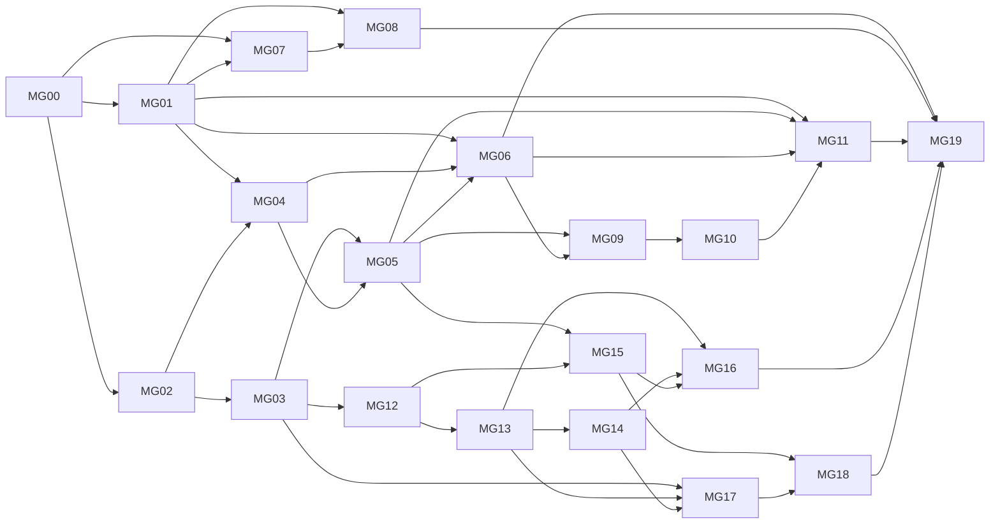

# 菜单与角色授权治理候选实施切片

状态：`APPROVED`；用户已明确要求开始实施。20 个稳定切片按依赖推进，设计／实现／验证状态分别记录；MG00 首先冻结阶段 A 契约。

[总体计划](PLAN.md) · [当前状态](PROGRESS_STATE.md)。MG 前缀属于本子计划，不替换父计划 P0–P7、CE 或已完成 CM／GP 的 ID。

## 1. 唯一任务表

默认顺序为表中顺序；所有实施串行，不创建并行 Agent。规模 S/M/L 是相对复杂度，不是工期承诺；L 仅用于设计／跨系统验证，发现一片需要多个实施 pass 时保留父 ID 并明确细分，不扩大范围。

| ID | 可观察结果 | Needs | Owner／改动路径 | 契约／迁移归属 | Runtime | 规模 | 状态 |
|---|---|---|---|---|---|---|---|
| MG00 | 第一阶段规则、差异和统计口径明确，可据此实现 | 计划确认 | Auth 设计契约＋Commerce 声明契约 | 新 `CONTRACTS.md` 第一阶段；不改库 | 无新增 | M | DONE |
| MG01 | 修改一份项目声明即可一致生成导航与候选清单 | MG00 | Commerce `frontend/src/iam/navigation.ts` 及新声明；Auth 导出器／映射消费方 | 声明契约；保留旧 manifest v1 | 无新增 | M | DONE |
| MG02 | Owner 在预览弹层看到完整菜单及能力差异 | MG00 | `ApplicationCatalog`、domain/web/Controller、`CatalogEditor.tsx`、API 类型 | 兼容新增预览读契约；原则上无迁移 | 现有 Auth／console | M | DONE |
| MG03 | 分区管理员查看潜在受影响角色、来源和人员 | MG02 | `PortalManagement`、Mapper XML、Controller、预览详情 | 管理读契约；按执行计划加索引 | 现有 PG／console | M | DONE |
| MG04 | 发布记录关联项目提交、清单摘要及操作者，并可查询 | MG01、MG02 | `ApplicationCatalog`、`CatalogMapper`／XML、console 历史详情 | 不可变发布元数据，追加迁移 | 现有 PG | M | DONE |
| MG05 | 基础版本或影响依据变化后旧预览不能继续发布 | MG03、MG04 | Owner 发布用例／Controller、`CatalogEditor`、`useCommand` | 发布依据、幂等和兼容门禁契约；持久化按需 | 现有 PG／console | M | DONE |
| MG06 | 源码、部署声明和已发布目录不一致时能定位 | MG01、MG04、MG05 | 导出／核对工具、管理读接口、目录状态页面 | 漂移状态和受信证据契约；是否存核验结果按需 | 现有部署信息／PG | M | DONE |
| MG07 | Commerce 通过受信身份链路得到本人导航提示 | MG00、MG01 | Auth business API／SDK；Commerce `commerce-app/.../iam`／HTTP | D-NAV、只读业务契约；不复用管理 Token | 现有 IdP／SDK／授权图 | M | TODO |
| MG08 | Commerce 侧栏、搜索和默认入口按真实提示过滤 | MG01、MG07 | `CentralShell.tsx`、`navigation.ts`、`session.ts`、前端 client | 消费已发布 MG07 契约，无新授权模型 | 现有 Commerce 前后端 | M | TODO |
| MG09 | 环境隔离与机器发布的选型和契约明确 | MG05、MG06 | Auth 设计、IdP 能力核验、环境运行说明 | D-ENV、D-PUB；契约设计片 | 只核对既有组件 | M | TODO |
| MG10 | 受限机器身份只能发布获授权应用／目标 | MG09 | 认证边界、发布授权适配、catalog 用例、受控登记 | 发布委派／审计模型，追加迁移 | 现有 IdP／PG；选定隔离配置 | M | TODO |
| MG11 | CI 产出预览、受控发布并核对准确结果 | MG01、MG05、MG06、MG10 | 发布工具、相关 workflow／环境说明 | 发布客户端契约；不得绕过 MG05 | 隔离 CI 目标，不自动生产部署 | M | TODO |
| MG12 | 管理员看到角色 v1→v2 迁移对象及风险，不执行写入 | MG03 | `PortalManagement`／Mapper、角色页迁移预览 | D-MIG、D-SOURCE 和迁移契约设计＋只读实现 | 现有 PG／console | M | TODO |
| MG13 | 指定直接授权按固定范围／期限受控迁移，可断点恢复 | MG12 | `AccessManagement`、既有投影／栅栏、迁移任务和 UI | 任务／子项／来源谱系，追加迁移 | 复用现有执行组件 | M | TODO |
| MG14 | 组与审批来源有明确升级路径，不能伪装成直接授权 | MG13 | `AccessRequests`、组授权、来源 Owner、迁移 UI | 来源专项契约／审批快照兼容；迁移按需 | 现有目录／审批／投影 | M | TODO |
| MG15 | 能力可标记弃用，停止新增使用但不删历史 | MG05、MG12 | 生命周期用例、角色／Grant／策略写入口、目录 UI | D-RET、生命周期元数据，追加迁移 | 现有 PG／console | M | TODO |
| MG16 | 退役前所有引用能定位，退出条件可检查 | MG13、MG14、MG15 | 引用分析、能力状态、项目声明／接口核对、目录详情 | 退役门禁；沿用紧急停用，不降低版本 | 现有 PG／项目构建信息 | M | TODO |
| MG17 | 人员变化的多来源权限和失效结果可核对 | MG03、MG13、MG14 | `DirectoryPullImporter`、`LifecycleGovernance`、诊断 UI／OA 对接核对 | D-HR，沿用人员权威和来源版本 | 现有 OA／目录／投影 | M | TODO |
| MG18 | 管理员完成一次有记录的权限复核 | MG15、MG17 | 复核任务／条目、成员与来源详情、受控整改入口 | 周期／责任人／保留策略，追加迁移 | 首版人工触发，复用 PG | M | TODO |
| MG19 | 修正发布、断连恢复和迁移中断有可复现恢复证据 | MG06、MG08、MG11、MG16、MG18 | 定向真实演练、运行／回退说明、受影响 CI 检查 | 已冻结契约；不新建设施 | 获授权隔离目标 | M | TODO |

## 2. 每片修改、验收与恢复

每片以“实现＋窄验证＋必要审查＋文档同步”作为一个有界 pass。UI 片复用现有治理／Commerce 视觉与弹层组件，不换设计系统；统一覆盖 1440／390／320 视口、当前截图查看和实际按钮／详情路径，具体状态如下。

### MG00：第一阶段契约

- 输出声明 schema、稳定菜单 ID 规则、合法变更矩阵、差异字段语义、管理分区统计口径、发布依据和兼容策略。对新增 API 明确身份、错误、上限和版本，不先生成调用方猜测 JSON。
- 验收：改名、改路由、增删菜单、复用旧能力、新能力、非法能力变更都有明确预期；Owner 发布权限与人员明细管理权限分开；UI 模型绑定真实后续契约。
- 恢复：纯设计版本化，不改变历史契约。第一阶段契约通过前，MG01–MG06 不标 READY。

### MG01：导航声明同源

- 保留现有菜单 code；显式声明 route／label／parent／position／any_of。让导航、搜索路由集合和导出器消费相同声明；去掉当前正则解析导航及 35 页／42 节点的固定校验，替换为集合完整性和契约上限校验。
- 检查 Commerce 全部真实路由与声明一致，明确 `/collaboration/products` 和遗留 `products`／`stores` 的处理；不顺带改变能力语义。Auth 内的权限映射作为生成物或兼容消费方，不能继续独立手工维护同一菜单字段。
- 验收：增／删／移动／改名各一项，导出与实际导航完全对应；代码不因路由调整变成新 ID；重复、环和未知能力拒绝；当前菜单／权限一致性回归通过。
- 恢复：保留旧导出入口在兼容窗口；还未发布候选时只需程序回退，不改变现有目录。跨仓顺序先合入声明生产方，再交付兼容消费方，记录两个提交。

### MG02：完整差异预览

- 扩展既有只读预览，比较菜单新增／删除、名称、顺序、父级、路由、权限绑定；旧 added／retained 字段兼容保留。非法能力变更单独显示原因，不声称可发布。
- 在 `CatalogEditor` 展示分类和逐项详情；预览后编辑清单立即作废旧结果，403／409／503 可识别。
- 验收：每类差异单测＋真实 Owner HTTP＋弹层路径；同内容顺序变化不产生误报；仅 label 变化仍识别为展示差异；预览前后角色、Grant、审计写计数不变。
- 恢复：兼容响应可以回退旧 UI；不修改历史清单／哈希，不产生授权写入。

### MG03：授权影响分析

- 通过获授权分区，服务端分析关联固定角色、有效／待生效授权、组的当前成员和去重人员；补申请策略等依赖提示。复用 role-impact，但不把它的历史引用总数冒充有效授权数。
- 对复用旧能力的新入口报告可能受影响人员；对新能力显示尚未授予。显示统计时间、范围、完整性与依据，提供有界人员／来源详情；沿用 `PortalPermissions` 的独立诊断资格加当前委派，不能让普通目录管理员自动取得他人来源解释权限。
- 验收：多角色同一人去重、组与直接来源重叠、到期／撤销／停用／旧代际排除、PENDING 区分、第一页不能当完整统计；跨租户／应用／环境、无独立诊断资格或 Owner 仅有发布权的探测拒绝，不能将拒绝显示为零影响。
- 恢复：只读扩展，失败不返回旧的完整性结论；不新增授权。PG 验证真实过滤与查询计划。

### MG04：发布历史元数据

- 为新发布追加来源信息，包含项目提交、内容／展示摘要及固定发布版本；与快照、指针和审计同事务。提供有界历史列表／详情；旧发布显示“来源未记录”，不补造事实。
- 验收：同版原命令重试不重复历史／审计，改体冲突，审计失败全部回滚；旧快照 JSON 和两类摘要算法保持兼容，旧程序可继续读取。
- 恢复：新增表保留，旧程序忽略；不能删除发布历史来回退。

### MG05：受控发布依据

- 预览确认绑定基础版本和两类哈希；必要影响确认包含报告依据。发布重新验证 Owner／目标、候选、版本和相关依据，旧预览失效时返回明确冲突，不替用户自动换内容重试。
- 全部目录写入口按目标策略执行门禁，包括 UI、脚本、CLI 和未来机器发布；兼容启用必须先迁移调用方，不能只保护 UI。
- 验收：两 Owner 会话竞争、预览后目录／影响变化、权限撤销、同键同体重试、同键改体、网络未知结果；成功后仅目录／历史／审计变化，角色和 Grant 原样保留。
- 恢复：兼容门禁按已登记应用受控启用；回退不能解除已发生停用或撤权。目录成功与政策投影就绪分开呈现。

### MG06：漂移检测

- 消费固定源码制品和受信部署声明，比较已发布目录；显示最后成功发布、最后核验、具体差异和证据来源。未核验运行制品显示 UNKNOWN，不把手填部署版本当运行证明。
- 初版提供 CI／人工核对工具及真实接口结果展示，按需持久化结果；不默认引入定时器，不从用户提供的任意 URL 拉取内部服务。
- 验收：漏发布、旧项目版本、相同权限但展示变化、只有声明没有实测、目标不匹配、依赖不可用分别有准确状态。核对不写角色或 Grant。
- 恢复：停用核对仅影响诊断；不根据漂移自动回退目录或授权。

### MG07：业务菜单提示契约与后端路径

- 设计业务调用方只读入口，消费当前用户证据、受控调用方及明确分区；复用既有中央身份／actor 绑定，不能把某个业务能力的 execution reference 当成全部导航凭证。
- 根据契约扩展 Auth API／SDK 和 Commerce 后端适配；个人菜单顺序和版本依据按需兼容补齐。管理 `/me/access` 不是未经分析就可直接复用的 Commerce 接口。
- 验收：真实电商身份得到本人提示；主体／租户伪造、旧代际、错误 audience／调用方、停用和依赖失败拒绝；全目录管理明细不能泄漏给业务客户端。
- 恢复：提示路径不改变业务授权；失败不回退到允许全导航的旧结果。

### MG08：电商导航消费

- 过滤侧栏、移动导航和搜索；祖先仅组织可见子节点，不能顺带放开父页面。默认落地页从合法可见路由选择，`safeReturn` 继续允许列表防开放重定向。
- 深链不可访问时给明确提示；401 清空会话相关数据，403 无权限与空数据分开，503 展示故障而不保留旧允许菜单；身份／组织／环境切换取消旧请求。
- 验收：真实单能力用户、多能力用户、无权限用户及协作入口；页面开启后撤权再发请求被拒绝；过期响应不覆盖新上下文；前端藏菜单后直接调用接口仍受控。
- 恢复：UI 程序可回退，但不得移除服务端判权；兼容灰度范围由发布计划决定。

### MG09：生产隔离与机器发布设计

- 核对 IdP 可用的服务身份、audience／scope、密钥机制及现有部署目标；对独立实例／数据库隔离与同实例环境目录扩展写清取舍。默认推荐前者，最终选择需确认。
- 输出发布权限、目标绑定、短期凭据／轮换、禁用和审计契约。仅目录发布权限不包含角色创建、Grant、能力恢复或跨目标登记权限。
- 验收：能说明一个测试机器身份为何不能发布生产；单实例方案若选中，所有 catalog 读写及决策路径的环境迁移都有影响清单和兼容方案。
- 恢复：设计片无运行副作用；目标方案未确定不开放机器发布。

### MG10：受限机器发布

- 独立机器发布资格／委派，与 HUMAN Owner 保持明确关系；复用 MG05 的发布门禁。服务端不接受 body 中伪造 operator，不能把 SERVICE 当 HUMAN 来绕过 requireOwner。
- 在已选隔离目标验证有效、过期、禁用、错误目标及错误权限；凭据引用进入运行配置，明文不进入 Git／前端／日志。
- 验收：合法机器只可预览／发布授权应用；调用角色／Grant／恢复能力等越权操作拒绝；重复与审计失败符合既有事务规则。
- 恢复：撤销发布委派／停止工具，不恢复原授权或变更已经发布的目录；需要目录修正使用新版本。

### MG11：CI 发布闭环

- 构建生成候选及摘要，验证路由与能力声明，调用预览并保存报告；按目标风险流程授权发布，然后核对明确回执、历史和投影状态。遇未知结果重试原命令，不生成新键重复发布。
- 首先默认 dry-run，再启用获授权隔离目标；多实例应用启动不做发布；目标 URL／身份由受控配置选择。机器发布不能自动批准语义扩大或自动授予新增能力。
- 验收：完整隔离链路、错环境／错版本阻止、预览与发布之间被替换拒绝、凭据不到日志、结果可关联准确提交；正常 Git 推送不等于生产部署许可。
- 恢复：停止发布 job；业务部署回退和目录修正分开处理。

### MG12：角色迁移预览

- 对显式选定 old／new role 版本列出能力差异、现有来源、固定范围、剩余期限、成员代际和迁移资格；区分直接、组、审批来源，未选对象不影响。
- 冻结缩权是否允许短暂拒绝、增权审批和来源谱系契约。当前 source 唯一约束不能靠原位更新 role_id／scope／valid_to 规避。
- 验收：越管理上限、自授予、跨分区、混合资源与单范围不兼容、已到期／撤销对象拒绝；预览只读、可明确排除不支持来源。
- 恢复：无 Grant 写入，未确认规则不开始迁移。

### MG13：直接授权迁移

- 持久化任务和有界子项，记录原 Grant ID／版本、新角色版本、范围、期限、来源关联和逐项幂等键。建议缩权先撤旧并核对回执，再激活新授权，允许保守拒绝窗口；具体按 MG12 确定。
- 不延长期限、扩大范围或修改旧来源；新来源须有显式谱系并满足唯一约束。每项提交前重验管理权、成员和原版本；无法迁移的对象明确失败。
- 验收：真实 PG／授权图下的重复执行、并发撤权、管理员失权、中断续跑、部分失败、取消；无未经决定的叠加增权，旧来源不可复活。UI 有进度／失败详情／受控重试。
- 恢复：从子项检查点继续；取消停止未提交项，已撤销对象不自动恢复，需要新的授权决定。

### MG14：组和审批来源迁移

- 同一组 Grant 的影响按当前成员展开，保留组来源；人员退组时不能从迁移任务补回资格。
- 审批策略版本与历史已批准申请分开：新申请可使用新策略，存量申请／Grant 是否升级由原来源规则和审批流程决定；不能改历史快照或伪造批准。
- 验收：组成员变动、审批完成／撤回竞态、同人多来源、超上限、来源 Owner 拒绝；多个来源情况下撤一个来源不误报整体权限消失。
- 恢复：按来源任务记录续跑，审批／组回退不能恢复已撤销历史授权。

### MG15：弃用与停止新增使用

- 将能力生命周期与紧急 disabled 区分，新增受控状态和原因／版本审计；禁止在新角色版本、Grant、委派或申请策略中新增已弃用能力的使用，具体矩阵在契约中确定。
- 历史角色、来源和原 manifest 保留，现有使用是否继续有效由已确认生命周期规则决定；清单发布不能清除停用状态。
- 验收：所有写入口同样执行生命周期门禁，直接 API 不能绕过 UI；同命令重试、并发版本冲突、恢复需要显式决定。
- 恢复：元数据扩展保留；启用前校验旧节点兼容，启用后旧程序不能绕过新授予规则，必要时保守阻止旧写节点。

### MG16：引用退出与退役

- 引用包括菜单、全部角色版本、有效／待生效 Grant、委派、申请策略、未完成申请、在途执行引用及受信项目 API／能力映射。区分必须阻断的活动引用和仅保留审计的历史引用。
- 只有退出条件满足才转入最终退役；紧急禁用可独立执行，不等待正常退役。历史编码保留兼容墓碑，不直接删除 manifest 原能力。
- 验收：删除最后菜单但接口或有效来源仍引用时不能完成正常退役；未核验项目 API 引用显示未证明，不默认零引用；旧版本重放不能重新授权。
- 恢复：解除禁用是新审计操作，不能用发布旧清单复活能力；保留引用证据。

### MG17：人员变更治理核对

- 复用 OA 员工／组织／离职权威和现有来源版本、人员状态、组同步与代际；补用户可读的变更影响／失败诊断及最终访问核对。部门／岗位映射规则另确认，不自动清空个人来源。
- 展示调岗后仍存的直接／审批／组来源；离职与全局主体停用作用域不同，操作按受控原链路执行，不通过新页面绕过运维／目录权限。
- 验收：重复／旧事件不能复活人员，退组／离职后旧 Token 无法访问，重新加入新代际不继承旧来源；多个授权来源准确解释，调岗保留例外有审计。
- 恢复：使用来源版本和既有检查点；未证明完整快照不删人，重试不延长资格。

### MG18：一次可审计的权限复核

- 第一版人工创建有界复核，选择获授权分区、负责人和范围，读取真实来源，记录保留／撤销／需调查的决定；整改调用现有受控撤权，不直接修改表。
- 周期调度、通知对象和保留期限按业务实际决定，首版不添加默认 cron／发送外部消息。
- 验收：复核前后资格变化有冲突提示，部分决定可恢复，撤销一个来源后显示其他仍有效来源；普通成员无法查看他人复核数据。
- 恢复：取消未处理项，已撤权不自动恢复；审计、幂等记录及保留规则完整。

### MG19：运行收口与恢复验证

- 汇总各片已有同版本证据，补完整链路尚未覆盖的定向场景；不机械重跑全仓。验证更高目录修正版本、IdP／图断连恢复、发布未知结果、任务进程退出后恢复。
- 验收：角色／Grant 基线保护、历史哈希、分区隔离、当前界面状态和真实接口拒绝一致；记录制品和契约版本。未授权生产目标明确未执行，容量或恢复指标未测不写达标。
- 恢复：完善运行手册，分别列程序回退、目录修正、授权补偿和数据恢复，保留失败证据；不清理共享组件或原数据。

## 3. 依赖和执行门禁

- 当前执行：MG00–MG05 DONE，继续MG06；按本表串行推进。
- 阶段 A CONTRACTS 已冻结，MG00 DONE；对应已满足依赖的实施可推进。MG07／09／12／15／17 的业务决策按各阶段就近确定，不需要本轮假装全部已批准。
- 全部标记 `parallel=no`：共享目录／授权契约、PG 迁移链、Controller、SDK、console 和跨仓声明需要串行集成；本计划不授予并行代理权限。
- 迁移唯一 Owner 为 Auth 治理后端；Commerce 只维护自有声明、适配和业务数据，不能直接写 Auth 表。
- Runtime 首次介入 MG10／MG11 的已选环境配置与隔离 CI 目标。其他片复用现有运行组件；实际部署按目标授权和验证另行执行。
- 每片完成更新本表状态和 [PROGRESS_STATE.md](PROGRESS_STATE.md)，附真实 TEST_RESULT／契约版本／Git 提交。一次验证通过才标 DONE；计划保存不把任何 MG 产品片标 DONE。
